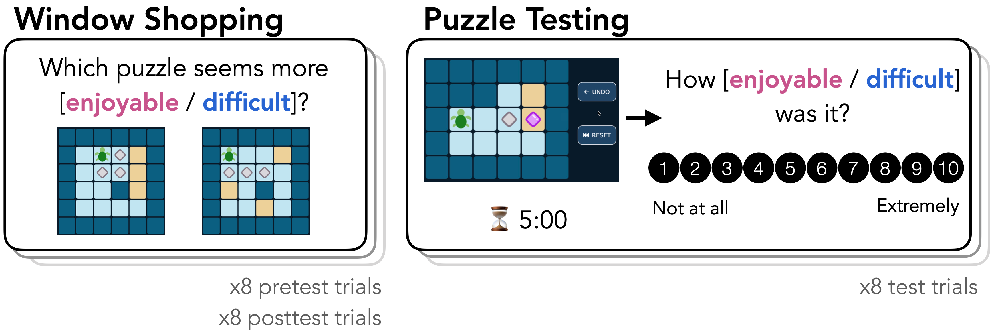
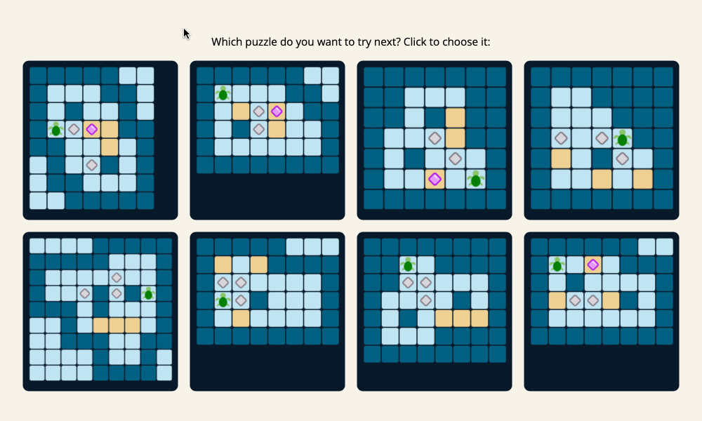

# What makes a puzzle fun to solve?

Project investigating predictors of enjoyment ratings in Sokoban.

- Study 1 (online corpus): Examining natural variation in puzzle features and enjoyment "in the wild"
- Study 2 (experiment): Impact of puzzle-solving experience on enjoyment ratings

## Where to find things

- `analysis` (aka `notebooks`): This directory will typically contain jupyter/Rmd notebooks for exploratory code development and data analysis.
- `experiments`: This will contain experimental code for collecting human behavioral data. It may contain task code for evaluating computational models' behavior.
- `plans`: This directory contains any study plans
- `results`: This directory is meant to contain "intermediate" results of computational/behavioral experiments.
	- `csv`: tidy dataframes used for analysis.
  - `plots`: analysis plots, which may be additionally polished and formatted for figures in a publication. 
- `stimuli`: This directory contains any download/preprocessing scripts for data that are _inputs_ to this project. This include scripts that upload materials to the lab `stimuli`  MongoDB database for web experiments.
- `utils`: This directory contains any files defining helper functions.

## Running code

1. Create virtual environment

`python3 -m venv .venv`

2. Activate virtual environment

`source .venv/bin/activate`

3. Install required packages

`python3 -m pip install -r requirements.txt`

## Study 1

We scraped puzzles and metadata from SokobanOnline.com to analyze what puzzle features account for variation in puzzle like rates.

## Study 2

### Sokoban environment

We use a JS implementation of Sokoban. Players control the turtle and try to turn grey pebbles into purple gems, by pushing pebbles onto yellow goal tiles. In this version, players can reset the level and undo previous moves.

### Experiment

  </img>

We ran an experiment to see what makes people think a puzzle is fun to solve. Stimuli comprised 3 sets of 8 puzzles, for a total of 24 puzzles. Over an experimental session, participants completed a pretest Window Shopping task, a Puzzle testing task, and a posttest Window Shopping task. Each participant received a different puzzle set for each task, with set order counterbalanced across participants.

#### Window shopping task

<video controls width="100%"><source src="stimuli/exp_compare_demo.mp4" type="video/mp4"></video>

Participants saw pairs of puzzles and judged which seemed more enjoyable/difficult. Participants completed 8 comparison trials, seeing each puzzle twice (with a different competitor). Participants could not interact with the puzzle.

#### Puzzle testing task

  </img>

Participants attempted 8 puzzles and rated how enjoyable or difficult each puzzle was. Each attempt lasted 5 minutes (or shorter if the puzzle was solved sooner). Rating condition was between-subjects.

Participants were not incentived for accuracy or speed, only for study completion.